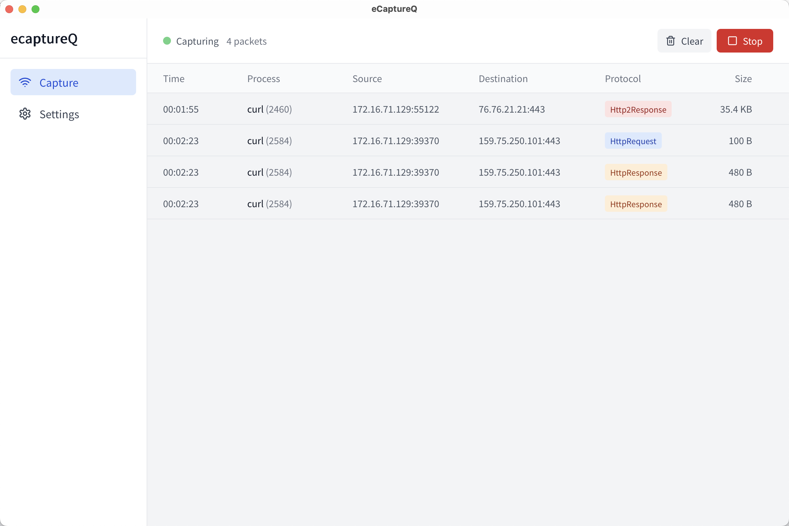
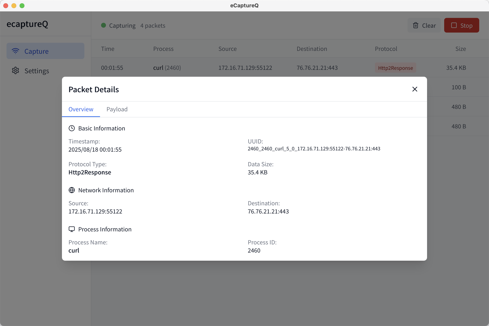

</img>

[简体中文](./README_CN.md) | English

[](https://github.com/gojue/ecaptureq)
[](https://github.com/gojue/ecaptureq)
[](https://github.com/gojue/ecaptureq/releases)


# eCaptureQ

Effortlessly capture TLS encrypted traffic in a cross-platform GUI using eBPF, without configuring CA certificates or performing Man-in-the-Middle (MITM) attacks.

## Overview

eCaptureQ is a cross-platform GUI for [ecapture](https://github.com/gojue/ecapture), visualizing its eBPF-powered packet capturing capabilities: capture TLS plaintext at the kernel level without needing a CA certificate or MITM.

This means you can debug and analyze the encrypted communications of any program in a simpler, more efficient, and non-intrusive way.

## Key Features

**Certificate-Free Capture with eBPF**: Directly capture and decrypt TLS traffic from the kernel without configuring CA certificates or a man-in-the-middle proxy.

**Real-time & Responsive View**: Displays network requests in real-time and automatically switches between a desktop table view and a mobile card view based on the device.

**Cross-Platform & Dual-Mode**: Runs as an all-in-one tool on Linux/Android, and as a remote client on Windows/macOS/Linux to connect to a server.

**Secure, Lightweight, and Native Experience**: Built with Rust on the backend for memory safety and native performance.

## Operating Modes

`eCaptureQ` offers two main operating modes to suit different user needs.

### 1\. Integrated Mode (All-in-One Package)

This is the standard, all-in-one mode. In this mode, the `ecapture` binary is bundled directly within the `eCaptureQ` application.

  * **Supported Platforms**: **Linux**, **Android**
  * **Features**:
      * **Out-of-the-Box**: No need to manually install or configure `ecapture`.
      * **Automated Management**: `eCaptureQ` automatically manages the lifecycle of the capture process.
      * **Simple and Convenient**: Ideal for quick traffic analysis on a local device.
  * **Requirements**:
      * On Linux and Android, this mode requires **root privileges** to run the eBPF program.

### 2\. Remote Mode (Client-Only)

In this mode, `eCaptureQ` runs as a standalone client without the bundled `ecapture` binary. It connects remotely via WebSocket to an `ecapture` instance that is **manually run** by the user.

  * **Client-Supported Platforms**: **Linux**, **Windows**, **macOS**
  * **Features**:
      * **High Flexibility**: Run `ecapture` on a Linux server and monitor it remotely from a Windows or macOS machine.
      * **No Root Required**: The `eCaptureQ` client itself does not require root privileges.
      * **Secure Isolation**: Suitable for scenarios where the capture process and the analysis interface need to have separate permissions.
  * **Requirements**:
      * The user must download and run `ecapture` separately on the target device.
      * `ecapture` must be started with the `--ecaptureq` flag to activate the WebSocket service.

## How to Use

### Integrated Mode (on Linux or Android)

1.  Download and install the standard version of `eCaptureQ`.
2.  (Linux only) Run the application with `sudo`:
    ```bash
    sudo /path/to/ecaptureq
    ```
3.  Click "Start" in the application interface to begin capturing.

### Remote Mode (e.g., connecting from Windows/macOS to a remote Linux server)

1.  On the **target Linux machine**, download and start `ecapture` with the `--ecaptureq` flag. Ensure the WebSocket address is accessible from your `eCaptureQ` client.
    ```bash
    # Run on the target server (requires root privileges)
    sudo ./ecapture tls --ecaptureq ws://0.0.0.0:28257
    ```
2.  On **your Windows/macOS/Linux machine**, download and run the `decoupled` version of `eCaptureQ`.
3.  Go to the settings page in `eCaptureQ`.
4.  Configure the "WebSocket Server URL" to the address `ecapture` is listening on (e.g., `ws://<SERVER_IP>:28257`).
5.  Return to the main page and click "Start" to begin receiving data.





## Tech Stack

  * **Core Engine**: **ecapture** (The underlying eBPF capture tool)
  * **Framework**: **Tauri** (A framework for building cross-platform applications with Rust)
  * **Backend**: **Rust** (with Tokio for asynchronous processing and Polars for high-performance data handling)
  * **Frontend**: **React** with **TypeScript**, **Tailwind CSS**

## Acknowledgement

  * **[ecapture](https://github.com/gojue/ecapture)**: Capturing SSL/TLS plaintext without a CA certificate using eBPF.
  * **[Tauri](https://tauri.app/)**: Build smaller, faster, and more secure desktop and mobile applications with a web frontend.