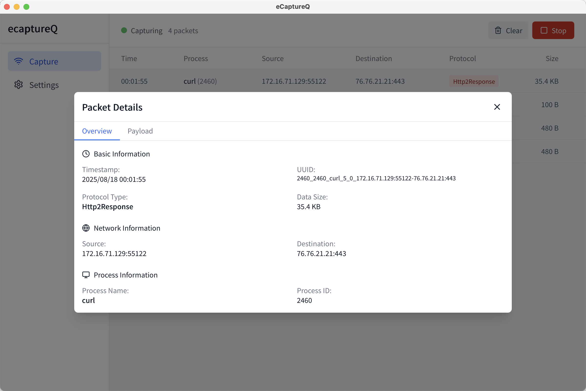

简体中文 | [English](./README.md)

[](https://github.com/gojue/ecaptureq)
[](https://github.com/gojue/ecaptureq)
[](https://github.com/gojue/ecaptureq/releases)


# eCaptureQ

无需配置 CA 证书，也无需实施中间人攻击（MITM），借助 eBPF 技术在跨平台图形界面中轻松捕获 TLS 加密流量。

## 概览

eCaptureQ 是 [eCapture](https://github.com/gojue/ecapture) 的跨平台 GUI，将其 eBPF 抓包能力以可视化方式呈现：无需 CA / MITM，在内核侧捕获 TLS 明文。

这意味着您可以更简单、更高效、更无侵入地调试和分析任何程序的加密通信。

https://github.com/user-attachments/assets/c8b7a84d-58eb-4fdb-9843-f775c97bdbfb

## 主要特性

**eBPF无证书抓包**: 无需配置CA证书或中间人代理，直接从内核捕获和解密TLS流量。

**实时与响应式视图**: 实时展示网络请求，并根据设备自动切换桌面表格或移动卡片视图。

**高级数据包过滤**: 使用自定义 SQL 查询过滤捕获的数据包，支持简单条件或复杂完整 SQL 语句。完美适用于专注特定流量模式、进程或载荷内容。

**跨平台与双模式**：在 Linux/Android 上可一键作为集成工具启动，同时在 Windows/macOS/Linux 上可作为远程客户端连接服务器。

**安全轻量的原生体验**: 使用Rust编写后端，实现内存安全并保持原生性能。
  
## 操作模式

`eCaptureQ` 提供两种主要的操作模式，以满足不同用户的需求。




### 1\. 集成模式 (一体化包)
  > [!IMPORTANT]  
  > Linux的集成版本需要自行编译

这是标准的一体化模式。在此模式下，`ecapture` 二进制文件被直接捆绑在 `eCaptureQ` 应用中。

  * **支持平台**: **Linux**, **Android**
  * **特性**:
      * **开箱即用**: 无需手动安装或配置 `ecapture`。
      * **自动化管理**: `eCaptureQ` 自动管理抓包进程的生命周期。
      * **简单方便**: 非常适合在本地设备上进行快速的流量分析。
  * **要求**:
      * 在 Linux 和 Android 系统上，此模式需要 **root 权限**来运行 eBPF 程序。

### 2\. 远程模式 (客户端)

在此模式下，`eCaptureQ` 作为一个独立的客户端运行，不捆绑 `ecapture` 二进制文件。它通过 WebSocket 远程连接到一个由用户**手动运行**的 `ecapture` 实例。

  * **客户端支持平台**: **Linux**, **Windows**, **macOS**
  * **特性**:
      * **高灵活性**: 可在 Linux 服务器上运行 `ecapture`，而在 Windows 或 macOS 上进行远程监控。
      * **无需 Root 权限**: `eCaptureQ` 客户端本身不需要 root 权限。
      * **安全隔离**: 适用于抓包进程和分析界面需要权限分离的场景。
  * **要求**:
      * 用户需在目标设备上单独下载并运行 `ecapture`。
      * `ecapture` 必须以 `--ecaptureq` 参数启动，以激活 WebSocket 服务。

## 数据包过滤

eCaptureQ 提供强大的基于 SQL 的数据包过滤功能，帮助您专注于特定的网络流量模式。

### 过滤模式

**简易过滤（推荐新手使用）**  
编写简单条件快速过滤数据包：
```sql
dst_port = 443 AND pname = 'chrome'
```

**高级 SQL 过滤（适合高级用户）**  
使用完整的 SQL 查询进行复杂过滤逻辑：
```sql
SELECT * FROM packets WHERE dst_port IN (80, 443) 
UNION 
SELECT * FROM packets WHERE pname LIKE 'python%'
```

### 常见用例

- **按端口过滤**: `dst_port IN (80, 443)` - 仅显示 HTTP/HTTPS 流量
- **按进程过滤**: `pname = 'curl'` - 显示特定应用程序的流量
- **按IP过滤**: `src_ip LIKE '192.168.1.%'` - 专注特定网段
- **搜索载荷**: `payload_utf8 LIKE '%password%'` - 查找包含敏感数据的数据包

### 文档

详细的过滤语法、示例和最佳实践：
- 📖 [SQL 过滤指南](./docs/custom_sql_examples.md)

## 使用方法

### 集成模式 (在 Linux 或 Android 上)

1.  下载并安装标准版本的 `eCaptureQ`。
2.  (仅限 Linux) 使用 `sudo` 运行应用：
    ```bash
    sudo /path/to/ecaptureq
    ```
3.  在应用界面点击 "Start" 开始抓包。

### 远程模式 (例如：在 Windows/macOS 上连接远程 Linux 服务器)

1.  在**目标 Linux 机器**上，下载 `ecapture` 并使用 `--ecaptureq` 参数启动它。请确保 WebSocket 地址可从 `eCaptureQ` 客户端访问。
    ```bash
    # 在目标服务器上运行 (需要 root 权限)
    sudo ./ecapture tls --ecaptureq ws://0.0.0.0:28257
    ```
2.  在**您的 Windows/macOS/Linux 机器**上，下载并运行 `decoupled` 版本的 `eCaptureQ`。
3.  进入 `eCaptureQ` 的设置页面。
4.  将 "WebSocket Server URL" 配置为 `ecapture` 正在监听的地址 (例如 `ws://<服务器IP>:28257`)。
5.  返回主页面，点击 "Start" 开始接收数据。


## 技术栈

  * **核心引擎**: **ecapture** (底层的 eBPF 抓包工具)
  * **框架**: **Tauri** (使用 Rust 构建跨平台应用的框架)
  * **后端**: **Rust** (使用 Tokio 进行异步处理, Polars 进行高性能数据处理)
  * **前端**: **React** with **TypeScript**, **Tailwind CSS**

## Acknowledgement

  * **[ecapture](https://github.com/gojue/ecapture)**: Capturing SSL/TLS plaintext without a CA certificate using eBPF.
  * **[Tauri](https://tauri.app/)**:  Build smaller, faster, and more secure desktop and mobile applications with a web frontend.

## 特别鸣谢

  * **[Dichgrem](https://github.com/Dichgrem)**：感谢在测试和产品完善方面提供的宝贵帮助。
